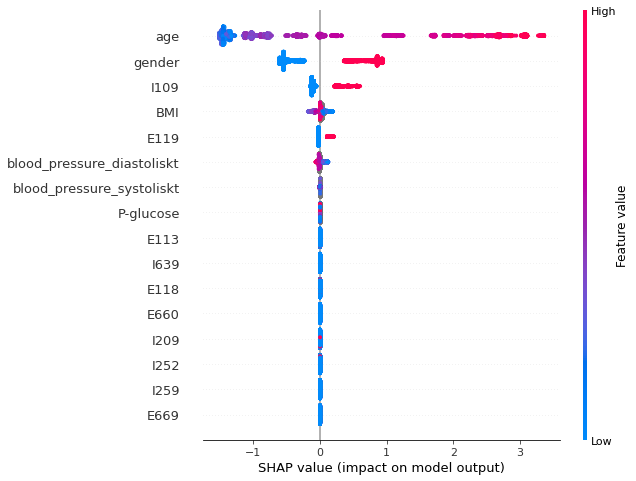
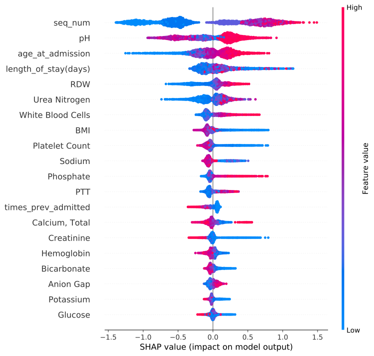

# Identification of cardiovascular risk factors of COVID-19 patients using SHAP values for tree-based machine learning models
## Introduction of respository
This repository contains the notebooks generated during my (Johannes Backlund) master thesis project.

NOTE: This does not contain the sensitive parts of my thesis (outputs), all code is here though.

## Abstract:
The exact cardiovascular risk factors involving COVID-19 patients are so far not fully known. This thesis uses two data sets (MIMIC, VGR) and tree-based machine learning models (Random forest, XGboost, LightGBM, CatBoost) to predict the outcome in mortality for pneumonia and COVID-19 patients. Using an algorithm known as Tree SHAP, the final trained tree model is interpreted together with distributions of mortality to identify the most important predictors (risk factors). The method used in this thesis produces intuitive graphs for analyzing risk factors by using supervised machine learning methods that focuses on creating models with good distinction ability. The same method could potentially be applied to identify mortality risk factors (or other types of risk factors) in the case of a new pandemic. The COVID-19 results show prevalence of risk factors such as; age, hypertension, chronic ischemic heart disease and diabetes. 

## SHAP summary plots
<table>
  <tr>
    <td> COVID-19 mortality shap summary plot </td>
   <td> Pneumona mortality shap summary plot </td>
   </tr> 
  </tr>
</table>

## NOTES
- The MIMIC-IV-v0.4 files needs to be keept in the same folder as the notebooks
## Requires; 
dask_ml, 

XGboost, 

lightGBM, 

Catboost, 

shap (https://github.com/slundberg/shap)
